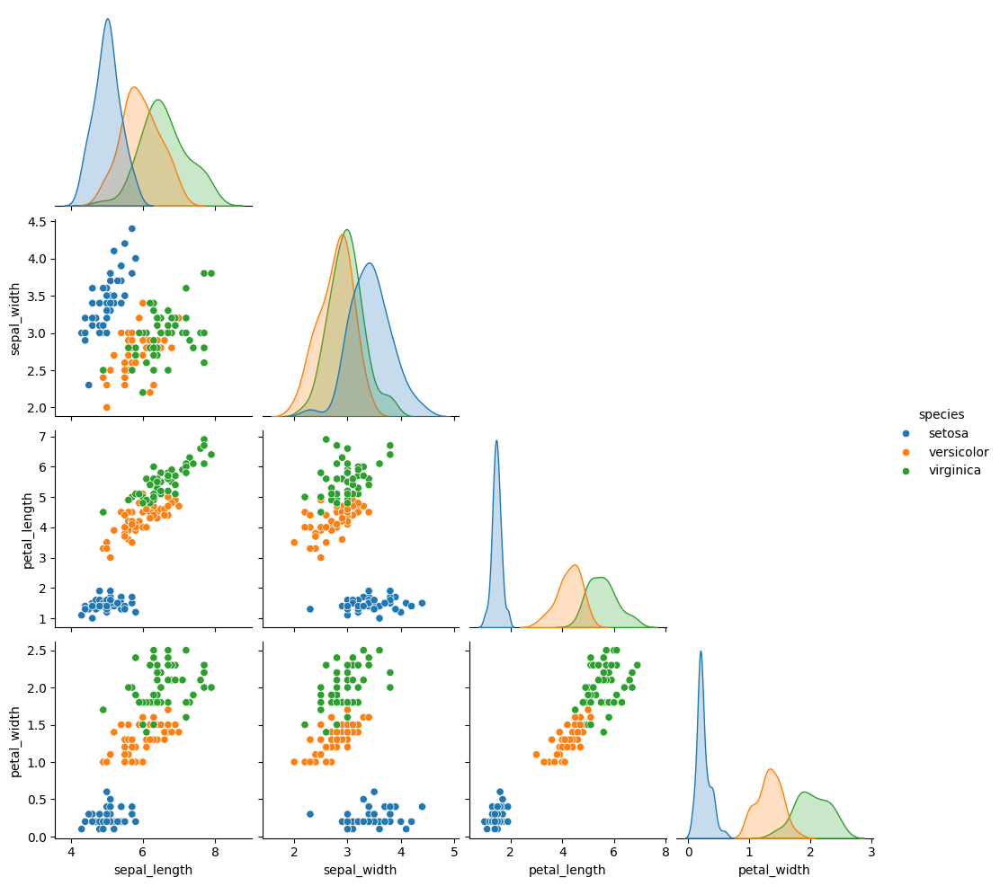
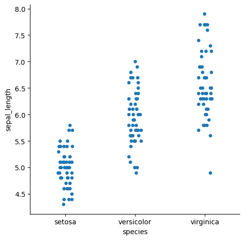

# Iris-Classification

## Problem 
- Analyze Iris dataset and apply feature scaling using StandardScaler.

## Data Dictionary

| Column       | Description                                                 |
| ------------ | ----------------------------------------------------------- |
| sepal_length | Length of the sepal of the flower (cm).                     |
| sepal_width  | Width of the sepal of the flower (cm).                      |
| petal_length | Length of the petal of the flower (cm).                     |
| petal_width  | Width of the petal of the flower (cm).                      |
| species      | Species of the iris flower (setosa, versicolor, virginica). |

## Summary

## Data Cleaning

No data cleaning had to be preformed on this data.

### Key Visualization
This include key visualizations that highlight important aspects of the data. 

#### Visualization 1:
This pairplot shows the difference featueres for the petals and sepals. It shows the pairplot of each features

#### Visualization 2: 
This charts shows the distrubtion between species across the different flowers (setosa, versicolor, virginica)

## Conclusions/Recommendations

the dataset was trained on with the data

- KNeighbors Regression
- HistGradientBooot Regression
- Linear Regression
- Random Forest Regression

The result of the models are below

| Model               | Accuracy |
| ------------------- | -------- |
| KNeighbors          | 0.82     |
| HistGradientBooting | 0.74     |
| Linear Regression   | 0.79     |
| Random Forest       | 0.99     |

Here the best score here is the Random Forest was trained on the four features.

