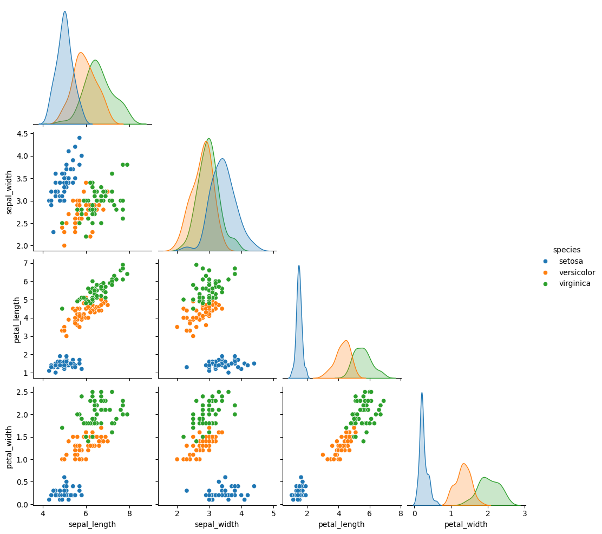
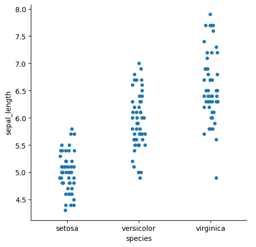
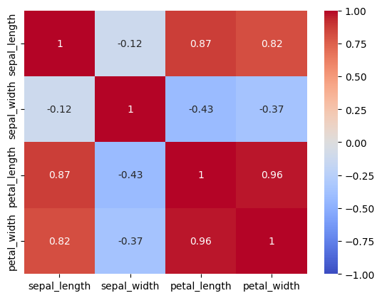

# Iris-Classification
**End-to-end machine learning project** demonstrating data exploration, feature scaling, and classification of Iris flower species using scikit-learn.


## Overview 
This analysis the famous Iris dataset to classify species using scaled features using classification


## Key Skills Demonstrated:
- Exploratory Data Analysis
- Feature scaling (StandardScaler)
- Supervised classification
- Model evaluation and comparison


## Dataset
- **Source:** UCI Machine Learning Repository 
- **Features:** 4 numeric (sepal length/width, petal length/width)
- **Target:** 3 species classes
- **Size:** 150 samples, balanced classes
- No missing values or major outliers after initial inspection


## Project Structure
Iris-Classification/
├── data/                
├── images/             
├── basic/               
├── EDA-Iris classification _ lab lesson.ipynb  
├── README.md


## MEthodology
1.**Data Loading & Cleaning** - No data cleaning had to be preformed on this dataset, no missing value, NaN values or special characters were present in the dataset, outliers were deteched 
2.**Exploratory Data Analysis** - Pairplot shows the difference featueres for the petals and sepals. It shows the pairplot of each features
3.**Preprocessing** - Applied `StandardScaler` to normalize featueres.
4.**Modeling** - Trained & compared three classifiers on the scaled data.
5.**Evaluation** - Eccuracy on test set.


## Results
Random Forest Classifier delivered the best preformance:

| Model               | Accuracy |
| ------------------- | -------- |
| KNeighbors          | 0.82     |
| Linear Regression   | 0.79     |
| Random Forest       | **0.99**     |

**Best Model:** Random Forest Classifier (Trained on all four featuers) 

<br>

**1. Pairplot of Featueres**

This pairplot shows the difference featueres for the petals and sepals, especially using petal measurements.


**2. Species Distribution** 

Balance classes across setosa, versicolor and virginica.


**3. Correlation Heatmap** 

strongest correlation is between petal witdh and petal height with `0.96` correlation.


## How to Run the Project
Clone the repo
```bash
git clone https://github.com/WatchTheory/Iris-Classification.git
cd Iris-Classification
```


